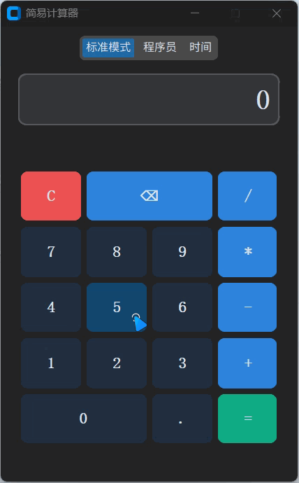

# Simple Calculator

一个基于 Python `customtkinter` 构建的现代风格多功能计算器。


## ✨ 特性

- **标准模式**：支持基础的加、减、乘、除、括号等算术运算。
- **程序员模式**：
  - 支持多进制转换：十六进制 (HEX)、十进制 (DEC)、八进制 (OCT)、二进制 (BIN)。
  - 支持位运算：左移 (<<)、右移 (>>)、取模 (%)。
  - 动态按钮状态：根据选择的进制自动启用/禁用相应按钮。
- **时间模式**：支持小时 (h) 与分钟 (m) 之间的快速转换。
- **现代 UI**：采用 `customtkinter` 打造，支持深色模式。
- **MVC 架构**：代码结构清晰，易于扩展和维护。

## 🚀 快速开始

### 1. 安装依赖

确保你的系统中已安装 Python 3.8 或更高版本。

```bash
pip install customtkinter
```

### 2. 运行程序

克隆仓库或下载源码后，直接运行 `main.py`：

```bash
python main.py
```

## 🛠️ 项目结构

- `main.py`: 程序入口，负责初始化和启动。
- `model.py`: 逻辑模型，处理核心计算、进制转换和时间转换。
- `view.py`: 图形界面，使用 `customtkinter` 构建。
- `controller.py`: 控制器，协调视图与模型之间的交互。
- `formatter.py`: 结果格式化工具。

## 演示


## 📄 许可证

本项目采用 [MIT License](LICENSE) 许可。
